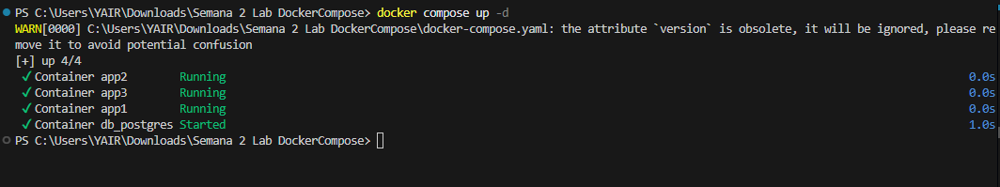

# Semana 02: Despliegue con Docker Compose


## Configuración y Variables de Entorno
En el proyecto se utiliza el archivo `.env` para ocultar los datos como claves y contraseñas para el archivo docker en este caso

- `MESSAGE`: Variable que se utiliza en las 3 APIS.
- `POSTGRES_USER`: Usuario mencionado para la base de datos POSTGRESSQL
- `POSTGRES_PASSWORD`: Contraseña para la Base de datos.
- `POSTGRES_DB`: Nombre de la Base de datos

## Comandos:
Para levantar mayormente a las APIS usamos:
```bash
docker compose up 
```
Para forzar a la creación de los contenedores:
```bash
docker compose up --build
```

Para detener a los contenedores en caso de reiniciar su funcionamiento:
```bash
docker compose down
```

Para levantar a los contenedores con la base de datos:
```bash
docker compose up -d
```

## Conceptos de Docker

### Tipos de Redes en Docker
1. **Bridge (Puente):** Es una red predeterminada , la cuál está dentro de tu computadora para que los contenedores se puedan comunicar.
2. **Host:** Hace que el contenedor no tenga una protección y use la dirección IP de la computadora actual.
3. **None (Ninguna):** Aísla a los contenedores de cualquier red.
4. **Overlay:** Se usa para conectar contenedores que están en diferentes computadoras.

### Tipos de Volúmenes en Docker
1. **Named Volumes (Volúmenes Nombrados):** Son los más comunes ya que el Docker se encarga completamente ahí de gestionarlo.
2. **Bind Mounts:** El usuario dice la carpeta exacta de creación a comparación del Named Volumes.
3. **tmpfs Mounts:** Se guardan temporalmente en la memoria ram en vez del disco duro. Sirve más para datos temporales

## Captura del proyecto 


---
**Créditos:**
-
- Vasquez Marquina Yair Asael
